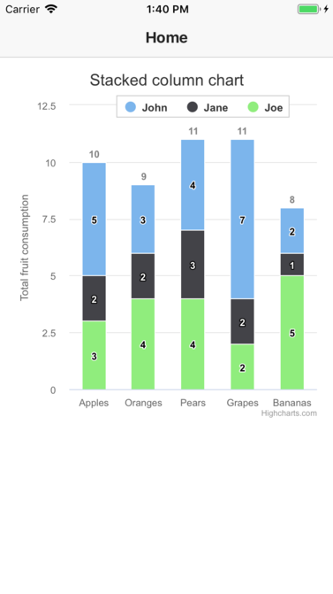

# NativeScript Highcharts

This plugins allows you to use Highcharts in NativeScript.

## Screenshots

 &nbsp;&nbsp;&nbsp;&nbsp;


## Demo apps
 
### NativeScript-Core (XML)
Check out the [demo](/demo) folder. This is how to clone and run it:

```bash
git clone https://github.com/mhtghn/nativescript-highcharts
cd nativescript-highcharts/src
npm run demo.ios # or demo.android
```

### NativeScript-Angular
Check out the [demo-angular](/demo-angular) folder. This is how to clone and run it:

```bash
git clone https://github.com/mhtghn/nativescript-highcharts
cd nativescript-highcharts/src
npm run demo-angular.ios # or demo-angular.android
```

## Installation


```javascript
tns plugin add nativescript-highcharts
```

## Usage 

### NativeScript-Core

#### TypeScript

Create your Highcharts options object just like you did with plain Highcharts. You can find all the possible options [there](https://api.highcharts.com/highcharts/). Then convert the options to a string because for now you have to pass the options as a string to the plugin. 
```typescript
...
export class HomeViewModel extends Observable {
    chartOptions = {
        chart: {
            type: 'column'
        },
        title: {
            text: 'Stacked column chart'
        },
        xAxis: {
            categories: ['Apples', 'Oranges', 'Pears', 'Grapes', 'Bananas']
        },
        yAxis: {
            min: 0,
            title: {
                text: 'Total fruit consumption'
            },
            stackLabels: {
                enabled: true,
                style: {
                    fontWeight: 'bold',
                    color: 'gray'
                }
            }
        },
        legend: {
            align: 'right',
            x: -30,
            verticalAlign: 'top',
            y: 25,
            floating: true,
            backgroundColor: 'white',
            borderColor: '#CCC',
            borderWidth: 1,
            shadow: false
        },
        tooltip: {
            headerFormat: '<b>{point.x}</b><br/>',
            pointFormat: '{series.name}: {point.y}<br/>Total: {point.stackTotal}'
        },
        plotOptions: {
            column: {
                stacking: 'normal',
                dataLabels: {
                    enabled: true
                }
            }
        },
        series: [{
            name: 'John',
            data: [5, 3, 4, 7, 2]
        }, {
            name: 'Jane',
            data: [2, 2, 3, 2, 1]
        }, {
            name: 'Joe',
            data: [3, 4, 4, 2, 5]
        }]
    };
    chartOptionsString = JSON.stringify(this.chartOptions);
    ...
}
```

#### XML
```xml
<Page class="page"
    navigatingTo="onNavigatingTo"
    xmlns="http://schemas.nativescript.org/tns.xsd"  xmlns:ui="nativescript-highcharts">

    <ActionBar class="action-bar">
        <Label class="action-bar-title" text="Home"></Label>
    </ActionBar>

    <GridLayout>
        <!-- Add your page content here -->
        <ui:Highcharts options="{{chartOptionsString}}"></ui:Highcharts>
    </GridLayout>
</Page>
```

### NativeScript Angular

#### TypeScript

Import the HighchartsModule in your module.
```typescript
...
import {HighchartsModule} from "nativescript-highcharts";

@NgModule({
    imports: [
        ...
        HighchartsModule
    ],
    ...
})
export class HomeModule { }
```

Create your Highcharts options object just like you did with plain Highcharts. You can find all the possible options [there](https://api.highcharts.com/highcharts/). Then convert the options to a string because for now you have to pass the options as a string to the plugin. 
```typescript
import { Component, OnInit } from "@angular/core";

@Component({
    selector: "Home",
    moduleId: module.id,
    templateUrl: "./home.component.html"
})
export class HomeComponent implements OnInit {
    chartOptions = {
        chart: {
            type: 'column'
        },
        title: {
            text: 'Stacked column chart'
        },
        xAxis: {
            categories: ['Apples', 'Oranges', 'Pears', 'Grapes', 'Bananas']
        },
        yAxis: {
            min: 0,
            title: {
                text: 'Total fruit consumption'
            },
            stackLabels: {
                enabled: true,
                style: {
                    fontWeight: 'bold',
                    color: 'gray'
                }
            }
        },
        legend: {
            align: 'right',
            x: -30,
            verticalAlign: 'top',
            y: 25,
            floating: true,
            backgroundColor: 'white',
            borderColor: '#CCC',
            borderWidth: 1,
            shadow: false
        },
        tooltip: {
            headerFormat: '<b>{point.x}</b><br/>',
            pointFormat: '{series.name}: {point.y}<br/>Total: {point.stackTotal}'
        },
        plotOptions: {
            column: {
                stacking: 'normal',
                dataLabels: {
                    enabled: true
                }
            }
        },
        series: [{
            name: 'John',
            data: [5, 3, 4, 7, 2]
        }, {
            name: 'Jane',
            data: [2, 2, 3, 2, 1]
        }, {
            name: 'Joe',
            data: [3, 4, 4, 2, 5]
        }]
    };

    chartOptionsString = JSON.stringify(this.chartOptions);
    ...
}
```

#### HTML

```HTML
<ActionBar class="action-bar">
<ActionBar class="action-bar">
    <Label class="action-bar-title" text="Home"></Label>
</ActionBar>

<GridLayout class="page">
    <!-- Add your page content here -->
    <Highcharts options="{{chartOptionsString}}"></Highcharts>
</GridLayout>
```

## About performance
This plugin is addressed to people who really want to use Highcharts in their NS apps. Because it uses a WebView to display the chart. So performance-wise it is not the best solution. If you want a pure native solution you should use [NativeScript UI's Chart component](https://docs.nativescript.org/ui/components/Chart/overview)

## Credit
This plugin is greatly inspired by [this demo](https://github.com/EddyVerbruggen/nativescripthighcharts) from [Eddy Verbruggen](https://github.com/EddyVerbruggen)
